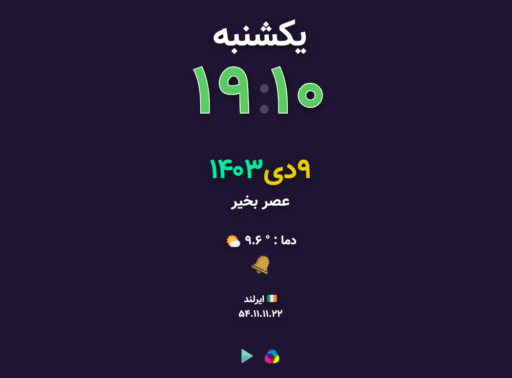

# Persian-Date-and-Time

This project is a web application that displays the current date and time in the Persian (Jalali) calendar format. It includes various features to enhance user experience, such as weather information, geolocation services, and audio notifications.
Features:

    Jalali Date and Time Display:
        Displays the current date and time in the Persian calendar format, refreshing every 5 seconds.

    Geolocation:
        Automatically fetches the user's location and displays the country name along with the IP address.
        Uses a default location (Shiraz) if geolocation fails.

    Weather Information:
        Retrieves and displays current weather data based on the user's location.

    Customizable Background Color:
        Users can change the background color with a simple click, and the selection is saved in cookies for future visits.

    Audio Notifications:
        Plays a chime every hour. Users can start or stop this feature with a button.

    Radio Streaming:
        Includes a button to toggle a classical music stream, with a play/stop feature.

    Responsive Design:
        The layout adapts well to various screen sizes, ensuring a smooth experience on mobile devices.

    Accessibility Features:
        Prevents scrolling and pinch-to-zoom actions, enhancing usability on touch devices.

    Fullscreen Mode:
        Users can enter fullscreen mode by right-clicking, allowing an immersive viewing experience.

    Custom Fonts:
        Utilizes Persian fonts to improve readability and aesthetics.

This application is designed for users who want to keep track of time in the Persian calendar while enjoying additional features like weather updates and audio cues.
